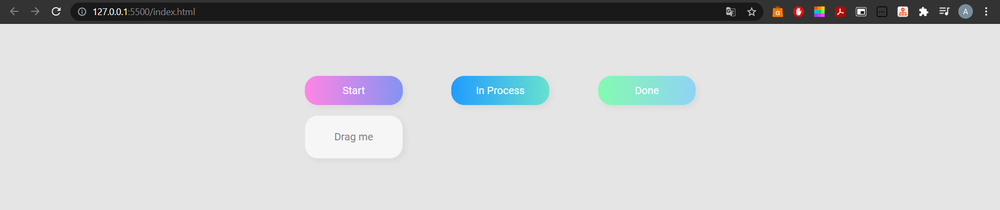

<h1 align="center">Drag&Drop</h1>

## Description

**Homepage**

<h2 align="center">Live Demo</h2>

**Drag&Drop**

This work implements a drag-and-drop mechanism. We have three static headings and one element that we can drag into any of these columns.

## Click edition

- **Click** the left mouse key to drag the element.